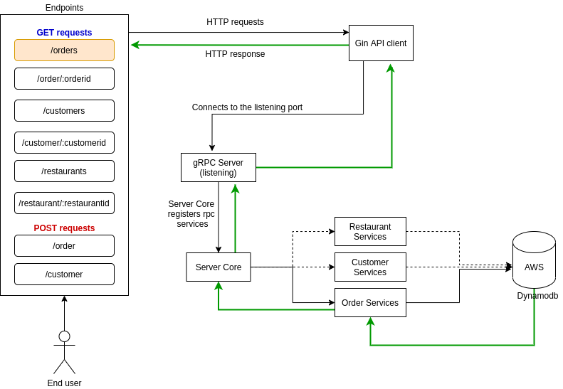

# bootcamp-project
Repository for bootcamp-project



### To run this project on local machine, follow the below steps :
-  Clone this repo : `git clone github.com/shashijangra22/bootcamp-project`
-  Make sure u have an instance of dynamodb running on port 8000.
-  Initialise the DB [if empty] : `make db`
-  Build the application : `make app`
-  Start the Server : `bin/server`
-  Start the API : `bin/api`

### To run this project in a docker container
- Build the server : `make docker-server`
- Built the api : `make docker-api`
- Create a bridge network on docker for communication b/w containers : `make docker-net`
- Run DynamoDB image : `docker run -p 8000:8000 --net=mynet amazon/dynamodb-local`
- Run the SERVER : `docker run -p 5051:5051 --net=mynet mygoapp-server`
- Run the API : `docker run -p 9001:9001 --net=mynet mygoapp-api`

### To Perform Testing :
- API Testing: run `make api-tests`

### EndPoints exposed by the API on http://localhost:9001

- `POST /login`                     Sign in the Admin to use the API
- `GET /api`                        HomePage
- `GET /api/customers`              Get all customers
- `GET /api/customer/{cid}`         Get a particular customer
- `POST /api/customer`              Add a new customer
- `GET /api/orders`                 Get all orders
- `GET /api/order/{oid}`            Get a particular order
- `POST /api/order`                 Add a new order
- `GET /api/restaurants`            Get all restaurants
- `GET /api/restaurant/{rid}`       Get a particular restaurant

### Data Model of the DB

Customer
----

```json
{
    "ID": int64,
    "Name": "<string>",
    "Phone": "<string>",
    "Address": "<string>"
}
```

Order
----

```json
{
    "ID": int64,
    "C_ID": int64,
    "R_ID": int64,
    "ItemLine": [
        {
            "Name":"<string>",
            "Price":float32        
        },
        {
            "Name":"<string>",
            "Price":float32
        }
    ],
    "Price":"float32",
    "Discount":int64"
}
```

Restaurant
----

```json
{
    "ID": int64,
    "Name": "<string>",
    "Online": bool,
    "Menu": [
        {
            "Name":"<string>",
            "Price":float32
        },
        {
            "Name":"<string>",
            "Price":float32
        }
    ],
    "Rating":float32,
    "Category":"<string>"
}
```