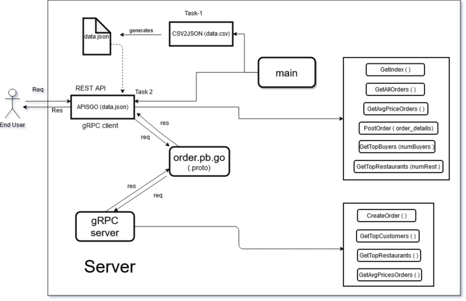

# Team2-Case-Study-1
repo for case study 1

## Lets first have a walkthrough our project :-

### To run this project, follow the below steps :-
1. Clone this repo.
2. Change the GOPATH = pwd of Team2-Case-Study-1
3. To install gjson, use : go get -u "github.com/tidwall/gjson"
4. To install GIN, use : go get -u "github.com/gin-gonic/gin"
5. Now, run command in Team2-Case-Study-1/src -> go run main.go

### Now, The webserver will run on localhost:9001.

To fetch different query :-
*  "localhost:9001/api" for HomePage
*  "localhost:9001/api/orders" for fetching all orders
*  "localhost:9001/api/avg-price" for average price of orders per customer
*  "localhost:9001/auth/top-buyers/:numBuyers" for top-customers based on expenditure
*  "localhost:9001/auth/top-restaurants/:numRestau" for top-restaurants based on its revenue
*  "localhost:9001/auth/new-order" to place a new order

#### The url with "auth" in path will require username = team2 & password = xurde